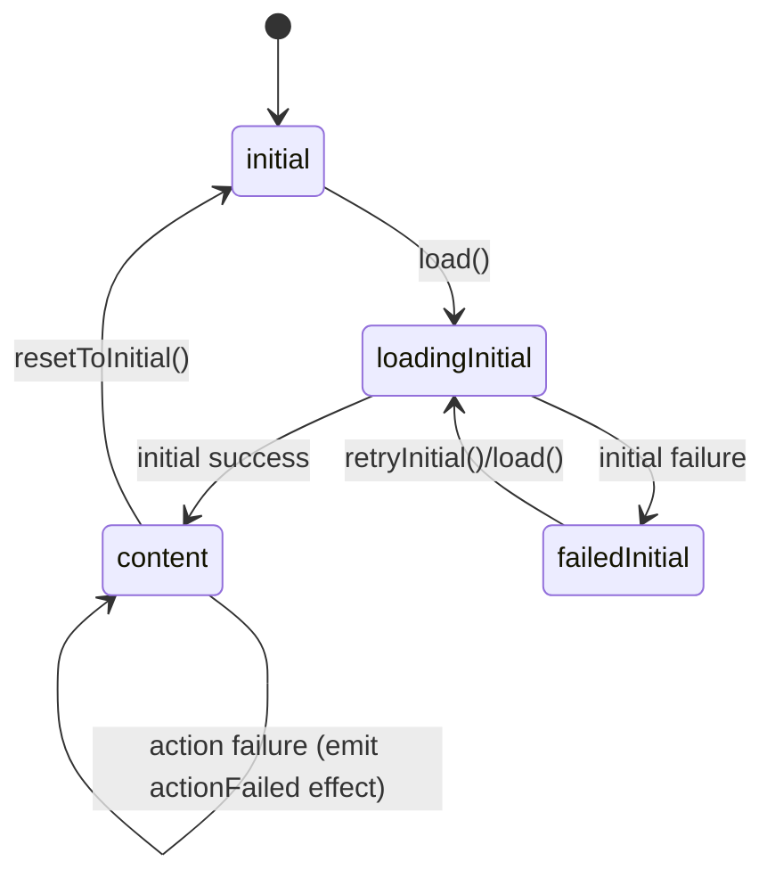
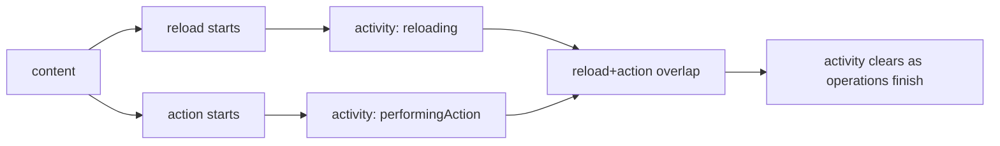

# AsyncContent

SwiftUI-first loading lifecycle primitives with three layers:
- `AsyncContentCore`: state enum + transitions + composition.
- `AsyncContentAsync`: async/await store + cancellation + retries + callback bridges.
- `AsyncContentSwiftUI`: rendering container + SwiftUI effect bindings.

## Install (SPM)

```swift
.package(url: "https://github.com/guillermomuntaner/AsyncContent.git", from: "0.1.0")
```

Products:
- `AsyncContentCore`
- `AsyncContentAsync`
- `AsyncContentSwiftUI`

## Start Simple (Recommended)

This is the primary integration path:
- Specialize once in your app.
- Keep feature code generic only over content.
- Start with **no transient errors** (`TransientError == Never`).

### 1) Specialize For App Errors (Simple Loading Case)

```swift
import AsyncContentAsync
import AsyncContentCore
import AsyncContentSwiftUI
import SwiftUI

enum AppUIError: Error, Equatable, Sendable {
    case network
    case unauthorized
    case unknown
}

@MainActor
final class UsersViewModel: ObservableObject {
    // No transient errors yet: use Never.
    let store = AsyncContentStore<[String], AppUIError, Never>(isEmpty: { $0.isEmpty })

    func load() {
        store.load {
            .success(["Ana", "Kai"])
        }
    }

    func retry() {
        _ = store.retryInitial()
    }
}
```

### 2) View Side (Defaults First)

Use container defaults first:
- loading view defaults to `ProgressView`
- activity overlay defaults to material `ProgressView` for reload/action states

```swift
struct UsersScreen: View {
    @StateObject private var vm = UsersViewModel()

    var body: some View {
        AsyncContentContainer(
            resource: vm.store.resource,
            isEmpty: { $0.isEmpty },
            content: { users in
                List(users, id: \.self) { Text($0) }
            },
            initialError: { _ in
                VStack(spacing: 12) {
                    Text("Could not load users")
                    Button("Retry") { vm.retry() }
                }
            },
            empty: {
                Text("No users yet")
            }
        )
        .onAppear { vm.load() }
    }
}
```

### 3) Observation Framework Side (iOS 17+ / macOS 14+)

If you use Observation instead of `ObservableObject`:

```swift
import AsyncContentAsync
import AsyncContentSwiftUI
import Observation

@available(iOS 17, macOS 14, *)
@Observable
@MainActor
final class UsersState {
    let store = ObservableAsyncContentStore(
        base: AsyncContentStore<[String], AppUIError, Never>(isEmpty: { $0.isEmpty })
    )
}
```

## Customize Loading, Error, Empty

After the simple path works, specialize visuals and error mapping.

```swift
AsyncContentContainer(
    resource: vm.store.resource,
    isEmpty: { $0.isEmpty },
    content: { users in
        List(users, id: \.self) { Text($0) }
    },
    loading: {
        VStack(spacing: 8) {
            ProgressView()
            Text("Loading users...")
        }
    },
    initialError: { error in
        switch error {
        case .network: Text("No internet connection")
        case .unauthorized: Text("Please sign in")
        case .unknown: Text("Something went wrong")
        }
    },
    empty: {
        Text("No users found")
    },
    overlay: { activity in
        if activity != .none {
            ProgressView(activity == .reloading ? "Refreshing..." : "Updating...")
                .padding(12)
                .background(.ultraThinMaterial, in: RoundedRectangle(cornerRadius: 12))
        }
    }
)
```

For iOS 17+ / macOS 14+, you can use `ContentUnavailableView` via `UnavailablePresentation`:

```swift
@available(iOS 17, macOS 14, *)
let view = AsyncContentContainer(
    resource: vm.store.resource,
    isEmpty: { $0.isEmpty },
    emptyPresentation: .init(title: "No users", message: "Try another filter", systemImage: "person.2.slash"),
    initialErrorPresentation: { _ in
        .init(title: "Could not load", message: "Try again", systemImage: "wifi.exclamationmark")
    },
    content: { users in
        List(users, id: \.self) { Text($0) }
    }
)
```

## Add Transient Errors (Reload / Action)

When needed, add a transient error type.

```swift
let store = AsyncContentStore<[String], AppUIError, AppUIError>(isEmpty: { $0.isEmpty })
```

- `BlockingError`: full-screen initial failures (`.failedInitial`).
- `TransientError`: one-shot reload/action failures (`.reloadFailed`, `.actionFailed`).

Render transient failures with `effectBinding()`:

```swift
.alert(item: vm.store.effectBinding()) { effect in
    switch effect {
    case .reloadFailed:
        Alert(title: Text("Reload failed"))
    case .actionFailed:
        Alert(title: Text("Action failed"))
    }
}
```

If your app does not need transient errors, keep `TransientError = Never`.
In that mode, convenience overloads are available:
- `reload(operation: @Sendable () async -> Value)`
- `performAction(operation: @Sendable () async -> Void)`
- `performAction(operation: @Sendable (Value) async -> Value)`

## Full State Flow

### State Machine



### Activity Overlay Flow



## Advanced

### Lower-Level API (`AsyncContentCore`)

Use the enum + transitions directly:
- `startInitialLoad`
- `finishInitialSuccess`
- `finishInitialFailure`
- `startReload`
- `finishReloadSuccess`
- `finishReloadFailure`
- `startAction`
- `finishActionSuccess`
- `finishActionFailure`
- `resetToInitial`
- `mapValue`
- `mapBlockingError`

### Integrate Enum-Only

Keep `AsyncContent<Value, BlockingError>` in your own reducer/store architecture.
Use the transition methods manually and emit your own side effects.

### Integrate Store-Only

Use `AsyncContentStore` for concurrency/cancellation, but render with your own UI layer instead of `AsyncContentContainer`.

### Composition

For dual-source screens:
- `combine2` to combine blocking phases.
- `mergeEffects` to merge transient effect queues.

### Callback Bridges

High-level operations also support callbacks:
- `load(from:)`
- `reload(from:)`
- `performAction(from:)`

## Testing

The package includes tests for:
- state transitions and guards
- cancellation / single-flight behavior
- effect emission and consumption
- `Never` transient convenience path
- SwiftUI integration helpers

Run:

```bash
swift test
```

## Demo App

See `Examples/AsyncContentDemo` for:
- app-level specialization with fixed error type
- default-first integration
- custom loading/error/empty/overlay views
- transient error alerts
- previews and unit tests
